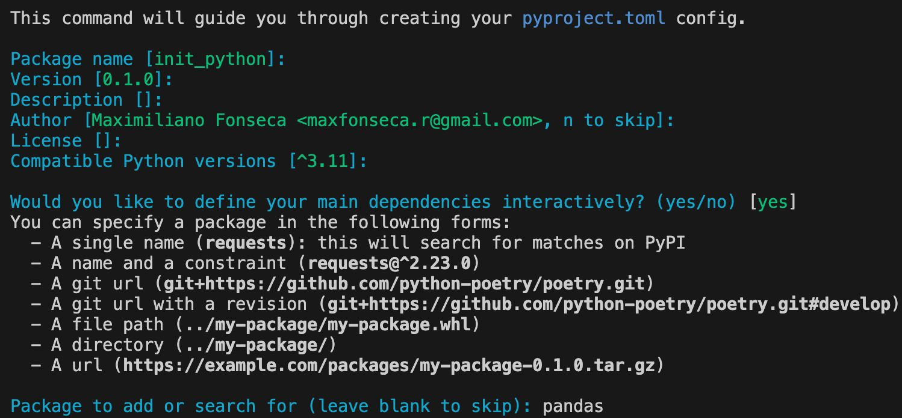
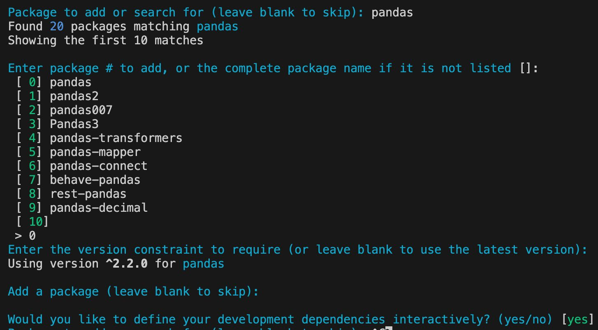

# Initializing a project in Python
These are the steps I normally follow to start a python project, I do it more as a reminder to myself.

## Prerequisites
1. Installation Pyenv:

    ### [MacOS](https://github.com/pyenv/pyenv 'Pyenv repo') 
    ```bash
    brew update
    brew install pyenv
    ```
    ### [Windows](https://github.com/pyenv-win/pyenv-win 'Pyenv-win') || Powershell
    ```bash
    Invoke-WebRequest -UseBasicParsing -Uri "https://raw.githubusercontent.com/pyenv-win/pyenv-win/master/pyenv-win/install-pyenv-win.ps1" -OutFile "./install-pyenv-win.ps1"; &"./install-pyenv-win.ps1"
    ```
## Init project
Having the folder/repository created
1. Set Python version, open your Terminal and execute the following commands:

    ### MacOS / Linux 
    ```bash
    pyenv versions # Installed versions
        pyenv install -l #List python version list
        pyenv install <version> # Install your version if needed
    pyenv local <version> # Set the version needed
    pip install poetry # Install virtualenv
    poetry --version # Check poetry version
    ```
    ### Windows
    ```bash
    pyenv versions # Installed versions
        pyenv install -l #List python version list
        pyenv install <version> # Install your version if needed
    pyenv local <version> # Set the version needed
    pip install poetry # Install virtualenv
    poetry --version # Check poetry version
    ```
2. Init poetry project

    Poetry init new project

    ### [MacOS / Linux / Windows](https://python-poetry.org/docs/basic-usage/ 'Poetry') 
    ```bash
    #Init poetry project
    poetry init
    #Project data, what is in braces is the default, we can press enter if we want to use these values.
    #This command will guide you through creating your pyproject.toml config.
        Package name [init_python]:
        Version [0.1.0]:
        Description []: 
        Author [Maximiliano Fonseca <maxfonseca.r@gmail.com>, n to skip]:
        License []:
        Compatible Python versions [^3.11]: #This depends on the version where you installed poetry
        Would you like to define your main dependencies interactively? (yes/no) [yes] #Here you will begin to install the dependencies/libraries that you will use in your project
            Package to add or search for (leave blank to skip): pandas #Example, installing pandas
            Enter package # to add, or the complete package name if it is not listed []:
                [ 0] pandas
                [ 1] pandas2
                [ 2] pandas007
                [ 3] Pandas3
            Enter the version constraint to require (or leave blank to use the latest version): 
        Would you like to define your development dependencies interactively? (yes/no) [yes] #The process is similar to dependencies; on this we would install poetry for example

    ```
    
    

3. Add dependencies as we progress in development
If we need to add dependencies while we are developing, it is necessary to use:

    ```bash
    poetry add <dependency-name>
    ```
4. Init folders structure:
    ### MacOS / Linux
    ```bash
    mkdir -p config container secrets source test utils && touch main.py config/__init__.py config/config.py source/__init__.py test/__init__.py utils/__init__.py container/deployment.yaml
    ```
    ### Windows || Powershell
    ```bash
    # Create directories
    New-Item -ItemType Directory -Path config, container, secrets, source, test, utils

    # Create files
    New-Item -ItemType File -Path main.py, 'config/__init__.py', 'config/config.py', 'source/__init__.py', 'test/__init__.py', 'utils/__init__.py', 'container/deployment.yaml'
    ```
    ### Windows || CMD
    ```bash
    REM Create directories
    mkdir config & mkdir container & mkdir secrets & mkdir source & mkdir test & mkdir utils

    REM Create files
    echo. 2>main.py
    echo. 2>config\__init__.py
    echo. 2>config\config.py
    echo. 2>source\__init__.py
    echo. 2>test\__init__.py
    echo. 2>utils\__init__.py
    echo. 2>container\deployment.yaml


    ```

4. How I work with the folders:
    1. **config**: This directory is often used to store configuration files. These might include settings for different environments (like development, staging, and production), constants used throughout your application, or configuration for external services.
    A common way to structure this is to have Python files such as dev.py, prod.py, staging.py etc. which are loaded based on the current environment. Each file could contain settings relevant to that environment.

    2. **source**: This directory, often also named src, contains the main source code for your application. This could include different modules, packages, or standalone scripts, depending on the size and complexity of your application.
    In larger projects, the source directory often contains subdirectories corresponding to different parts of your application. For example, if you were building a web application, you might have subdirectories for routes, models, controllers, etc.

    3. **test**: As you might expect, this directory is used to contain tests. These could be unit tests, integration tests, or others. A common structure is to have a mirror of your source directory, but with each file replaced by a corresponding test file.
    So if you had a file source/routes/user.py, you might have a corresponding test file test/routes/test_user.py. This makes it easy to find the tests for a given piece of functionality.

    4. **utils**: This directory is usually used for utility scripts or modules that are used across your application. For example, you might have a utils.py file with common helper functions, or a logging.py file to set up logging consistently across your application.

    5. container Directory: This is geared towards containerization aspects of your project (e.g., Docker or Kubernetes).

            deployment.yaml: A YAML file, typically used for Kubernetes to define how a containerized application should be deployed.

4. Project schema

        init_python
        ├── pyproject.toml
        ├── main.py
        ├── README.md
        ├── config
        │   └── __init__.py
        │   └── config.py
        ├── container
        ├── secrets
        ├── source
        │   └── __init__.py
        ├── test
        ├── utils
        │   └── __init__.py
        └── tests
            